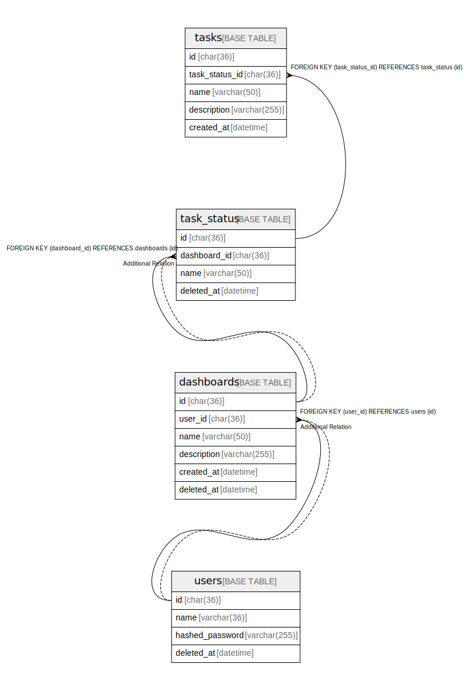

# todo_list

## Tables

| Name | Columns | Comment | Type |
| ---- | ------- | ------- | ---- |
| [dashboards](dashboards.md) | 6 | ダッシュボードテーブル | BASE TABLE |
| [task_status](task_status.md) | 4 | タスク状態テーブル | BASE TABLE |
| [tasks](tasks.md) | 5 | タスクテーブル | BASE TABLE |
| [users](users.md) | 4 | ユーザーテーブル | BASE TABLE |

## Relations

---

> Generated by [tbls](https://github.com/k1LoW/tbls)
