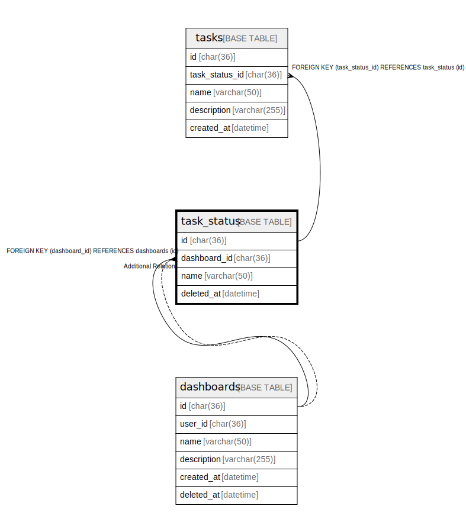

# task_status

## Description

タスク状態テーブル

<details>
<summary><strong>Table Definition</strong></summary>

```sql
CREATE TABLE `task_status` (
  `id` char(36) COLLATE utf8mb4_general_ci NOT NULL,
  `dashboard_id` char(36) COLLATE utf8mb4_general_ci NOT NULL,
  `name` varchar(50) COLLATE utf8mb4_general_ci NOT NULL,
  `deleted_at` datetime DEFAULT NULL,
  PRIMARY KEY (`id`),
  KEY `fk_dashboard_id` (`dashboard_id`),
  CONSTRAINT `task_status_ibfk_1` FOREIGN KEY (`dashboard_id`) REFERENCES `dashboards` (`id`)
) ENGINE=InnoDB DEFAULT CHARSET=utf8mb4 COLLATE=utf8mb4_general_ci
```

</details>

## Columns

| Name | Type | Default | Nullable | Children | Parents | Comment |
| ---- | ---- | ------- | -------- | -------- | ------- | ------- |
| id | char(36) |  | false | [tasks](tasks.md) |  | 状態UUID |
| dashboard_id | char(36) |  | false |  | [dashboards](dashboards.md) | ダッシュボードUUID |
| name | varchar(50) |  | false |  |  | 状態名 |
| deleted_at | datetime |  | true |  |  | 削除日時 |

## Constraints

| Name | Type | Definition |
| ---- | ---- | ---------- |
| PRIMARY | PRIMARY KEY | PRIMARY KEY (id) |
| task_status_ibfk_1 | FOREIGN KEY | FOREIGN KEY (dashboard_id) REFERENCES dashboards (id) |

## Indexes

| Name | Definition |
| ---- | ---------- |
| fk_dashboard_id | KEY fk_dashboard_id (dashboard_id) USING BTREE |
| PRIMARY | PRIMARY KEY (id) USING BTREE |

## Relations



---

> Generated by [tbls](https://github.com/k1LoW/tbls)
