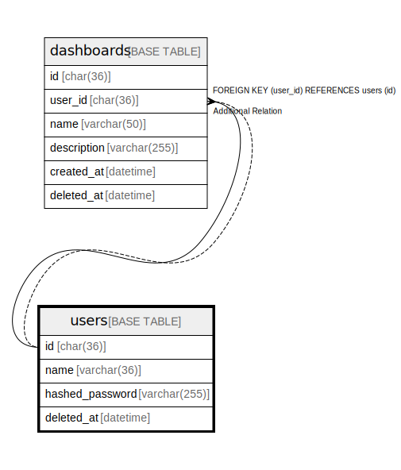

# users

## Description

ユーザーテーブル

<details>
<summary><strong>Table Definition</strong></summary>

```sql
CREATE TABLE `users` (
  `id` char(36) COLLATE utf8mb4_general_ci NOT NULL,
  `name` varchar(36) COLLATE utf8mb4_general_ci NOT NULL,
  `hashed_password` varchar(255) COLLATE utf8mb4_general_ci NOT NULL,
  `deleted_at` datetime DEFAULT NULL,
  PRIMARY KEY (`id`)
) ENGINE=InnoDB DEFAULT CHARSET=utf8mb4 COLLATE=utf8mb4_general_ci
```

</details>

## Columns

| Name | Type | Default | Nullable | Children | Parents | Comment |
| ---- | ---- | ------- | -------- | -------- | ------- | ------- |
| id | char(36) |  | false | [dashboards](dashboards.md) |  | ユーザーUUID |
| name | varchar(36) |  | false |  |  | ユーザー名 |
| hashed_password | varchar(255) |  | false |  |  | ハッシュ化されたパスワード |
| deleted_at | datetime |  | true |  |  | 削除日時 |

## Constraints

| Name | Type | Definition |
| ---- | ---- | ---------- |
| PRIMARY | PRIMARY KEY | PRIMARY KEY (id) |

## Indexes

| Name | Definition |
| ---- | ---------- |
| PRIMARY | PRIMARY KEY (id) USING BTREE |

## Relations



---

> Generated by [tbls](https://github.com/k1LoW/tbls)
